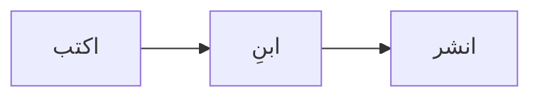

Ode هو نظام نشر شخصي مبني على Next.js 16 App Router. صُمِّم حول فكرة واحدة: محتواك ملفات نصية عادية في مستودع Git، والموقع تصدير HTML ثابت يمكن تشغيله في أي مكان.

هذا المقال توثيق وتقرير ميداني في آنٍ واحد. يغطي كل شيء من البنية المعمارية إلى النشر وسير عمل الكتابة اليومي.

## ما هو Ode

Ode ليس نظام إدارة محتوى بلوحة تحكم. لا توجد لوحة إدارة، ولا قاعدة بيانات، ولا صفحة تسجيل دخول. بدلاً من ذلك:

- المقالات **ملفات MDX** مخزّنة في مجلدات `posts/YYYY/slug/`
- الإعدادات ملف **`config.ini`** واحد في جذر المشروع
- يُجمَّع الموقع بالكامل إلى **HTML ثابت** بالأمر `npm run build`
- يمكن رفع مجلد الإخراج (`out/`) إلى أي مزوّد استضافة ثابتة

المكدس التقني بسيط بشكل مقصود:

| الطبقة | التقنية |
|---|---|
| الإطار | Next.js 16 App Router |
| المحتوى | MDX عبر `next-mdx-remote` |
| تمييز الأكواد | `rehype-highlight` (ثيم Gruvbox الداكن) |
| الرياضيات | KaTeX عبر `remark-math` + `rehype-katex` |
| المخططات | Mermaid (على جانب العميل) |
| التصميم | CSS مكتوب يدوياً، لوحة ألوان الورق الدافئ |
| الخطوط | Iosevka Aile (أحادي المسافة)، Schibsted Grotesk (النص)، Podkova (العناوين) |
| النشر | تصدير ثابت — أي CDN أو استضافة ملفات |

## هيكل المشروع

```
Ode/
├── config.ini              # إعدادات الموقع العامة
├── posts/
│   └── 2026/
│       └── my-post/
│           ├── en.mdx      # اللغة الافتراضية (الإنجليزية)
│           ├── zh.mdx      # الترجمة الصينية
│           └── ar.mdx      # الترجمة العربية
├── public/                 # الموارد الثابتة (صور، favicon)
├── src/
│   ├── app/                # صفحات ومسارات Next.js App Router
│   ├── components/         # مكونات React
│   └── lib/                # posts.ts, config.ts, i18n.ts …
├── locales/
│   ├── en.yaml             # نصوص واجهة المستخدم (إنجليزية)
│   └── zh.yaml             # نصوص واجهة المستخدم (صينية)
└── scripts/
    └── post.mjs            # أداة إدارة المقالات التفاعلية
```

## كتابة المقالات

### بيانات المقدمة (Frontmatter)

تبدأ كل مقالة بكتلة YAML frontmatter:

```yaml
---
title: "عنوان مقالتي"
date: 2026-04-16
category: Dev Log
eyebrow: تسمية اختيارية فوق العنوان
summary: جملة وصفية واحدة تظهر في القوائم وعلامات الميتا.
featured: false
lang: ar
tags: [وسم-أول, وسم-ثاني]
---
```

| الحقل | مطلوب | الوصف |
|---|---|---|
| `title` | ✓ | عنوان المقالة |
| `date` | ✓ | تاريخ النشر (YYYY-MM-DD) |
| `lang` | ✓ | رمز اللغة (`en`، `ar`، `zh`، `ru` …) |
| `category` | — | تجميع المقالات في صفحة الفئات |
| `summary` | — | يظهر في القوائم وعلامة `<meta description>` |
| `eyebrow` | — | تسمية صغيرة تُعرض فوق العنوان |
| `featured` | — | `true` للظهور في كتلة المميزة في الصفحة الرئيسية |
| `tags` | — | مصفوفة من الوسوم |

### إمكانيات MDX

**صناديق التنبيه:**

```
:::note
هذه ملاحظة.
:::

:::warning
تحذير.
:::

:::tip
نصيحة مفيدة.
:::

:::danger
إجراء خطير قادم.
:::
```

**الرياضيات (KaTeX):**

مضمّنة: `$E = mc^2$`

كتلة:
```
$$
\int_{-\infty}^{\infty} e^{-x^2}\, dx = \sqrt{\pi}
$$
```

**المخططات (Mermaid):**

````

````

### المقالات متعددة اللغات

تعيش كل مقالة في مجلد. أضف ملف لغة لترجمتها:

```
posts/2026/my-post/
├── en.mdx   ← افتراضي، URL: /en/blog/2026/my-post
├── zh.mdx   ← URL: /en/blog/2026/my-post/zh
├── ru.mdx   ← URL: /en/blog/2026/my-post/ru
└── ar.mdx   ← URL: /en/blog/2026/my-post/ar
```

يظهر بانر الترجمة تلقائياً أعلى كل مقالة. تُكتشف لغات الكتابة من اليمين إلى اليسار (العربية، العبرية، الفارسية، الأردية) تلقائياً وتُعرض المقالة بـ `dir="rtl"`.

## إدارة المقالات بـ `npm run post`

```bash
npm run post
```

**إنشاء مقالة** — تسأل الأداة عن العنوان والـ slug والتاريخ والفئة والملخص والوسوم وما إذا كانت مميزة. تنشئ `posts/YYYY/slug/en.mdx` بالبيانات الأولية الصحيحة.

**إضافة ترجمة** — شغّل `npm run post`، اختر «新建博文»، أجب بنعم على سؤال الترجمة، اختر المقالة الأصلية من القائمة وأدخل رمز اللغة.

**حذف مقالة** — تسرد الأداة جميع المقالات مجمّعة حسب اللغة. اختيار مقالة يحذف المجلد كاملاً مع جميع ترجماته.

تشمل رموز اللغات المدعومة أكثر من 140 رمزاً على غرار MediaWiki: `ar`، `zh`، `ru`، `es`، `ja`، `fr`، `de`، `ko`، `hi`، `pt` وغيرها كثير.

## الإعداد

عدّل `config.ini` لتخصيص الموقع دون لمس أي كود:

```ini
[site]
name     = إيان
brand    = إيان
locale   = en
subtitle = GNU & Linux | المصدر المفتوح | اختبار الاختراق
url      = https://yoursite.com
description = وصف موقعك هنا.

[links]
1 = GitHub   | https://github.com/you
2 = RSS Feed | /rss.xml

[disqus]
shortname =
```

## نشر Ode

يُجمَّع Ode إلى موقع ثابت بالكامل. الإخراج مجلد من ملفات HTML وCSS وJS يعمل على أي خادم ويب أو CDN بدون أي تبعيات من جانب الخادم.

### بناء الإخراج الثابت

```bash
npm run build
# الإخراج ← out/ (≈ 20 ميغابايت لموقع جديد)
```

---

### Cloudflare Workers (مُوصَى به)

يقدّم Cloudflare Workers الملفات الثابتة عبر شبكة CDN العالمية.

**الخيار أ — رفع مباشر:**

1. اذهب إلى [dash.cloudflare.com](https://dash.cloudflare.com) ← **Workers & Pages**
2. تطبيق جديد ← **Pages** ← **Direct Upload**
3. اسحب مجلد `out/` إلى منطقة الرفع
4. موقعك يعمل على `*.pages.dev` في ثوانٍ

**الخيار ب — تكامل Git (نشر تلقائي عند الدفع):**

أولاً، أضف `wrangler.toml` إلى جذر المشروع:

```toml
name = "ode"
compatibility_date = "2025-01-01"

[assets]
directory = "./out"
```

ثم اربط مستودعك في لوحة تحكم Cloudflare:

1. **Workers & Pages** ← **إنشاء** ← **ربط بـ Git**
2. اختر مستودعك
3. اضبط إعدادات البناء:

| الإعداد | القيمة |
|---|---|
| أمر البناء | `npm run build` |
| أمر النشر | `npx wrangler deploy` |
| المجلد الجذر | `/` |

كل `git push` إلى الفرع الرئيسي يُشغّل عملية بناء ونشر تلقائية. يُشغّل Cloudflare أمر `npm run build`، ثم يقرأ `npx wrangler deploy` ملف `wrangler.toml` وينشر محتوى مجلد `out/` كملفات ثابتة.

:::tip
تتضمن الخطة المجانية من Cloudflare Workers 100,000 طلب يومياً وتوزيع CDN عالمي. بالنسبة لمدونة شخصية هذا لا نهاية له فعلياً.
:::

---

### Railway

Railway يشغّل خادم Next.js مباشرة، مما يعني أن الموقع يُعرض من جانب الخادم بدلاً من كونه ثابتاً بالكامل.

1. أنشئ مشروعاً جديداً على [railway.app](https://railway.app)
2. اربط مستودع GitHub الخاص بك
3. يكتشف Railway تطبيق Next.js تلقائياً ويضبط أمر التشغيل على `npm run start`
4. يمنحك Railway نطاقاً فرعياً `.up.railway.app`؛ أضف نطاقك المخصص في الإعدادات

:::note
عند النشر على Railway، علّق أو احذف `output: "export"` في `next.config.ts` — يشغّل Railway خادم Node.js حياً، وليس ملفات ثابتة.
:::

---

### GitHub Pages

أنشئ `.github/workflows/deploy.yml`:

```yaml
name: النشر على GitHub Pages
on:
  push:
    branches: [main]
jobs:
  deploy:
    runs-on: ubuntu-latest
    permissions:
      contents: read
      pages: write
      id-token: write
    steps:
      - uses: actions/checkout@v4
      - uses: actions/setup-node@v4
        with:
          node-version: 20
      - run: npm ci
      - run: npm run build
      - uses: actions/upload-pages-artifact@v3
        with:
          path: out/
      - uses: actions/deploy-pages@v4
```

ثم اذهب إلى **Settings → Pages → Source → GitHub Actions** في مستودعك.

:::warning
GitHub Pages في الخطة المجانية يدعم المستودعات العامة فقط. المستودعات الخاصة تتطلب GitHub Pro أو استخدام منصة استضافة مختلفة.
:::

---

### Netlify

1. اسحب مجلد `out/` إلى [app.netlify.com/drop](https://app.netlify.com/drop)، أو
2. اربط مستودع Git واضبط:
   - أمر البناء: `npm run build`
   - مجلد النشر: `out`

---

### VPS / استضافة ذاتية

انسخ مجلد `out/` إلى خادمك وشغّله بـ Nginx أو Caddy:

```nginx
server {
    listen 80;
    server_name yourdomain.com;
    root /var/www/ode/out;
    index index.html;
    location / {
        try_files $uri $uri/ $uri.html =404;
    }
}
```

## خلاصة القول

Ode صغير بشكل مقصود. الهدف موقع سهل الفهم من البداية إلى النهاية، سهل النقل بين المضيفين، ومصمم للاستمرار. نص عادي كمدخلات، HTML ثابت كمخرجات.

```
اكتب MDX ← git push ← npm run build ← ارفع out/
```

هذا هو خط الأنابيب بأكمله.
