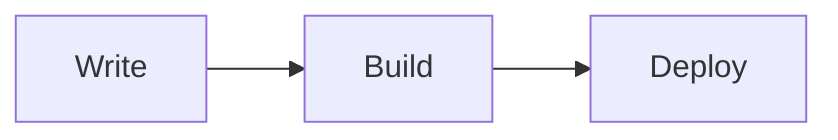

Ode is a personal publishing system built on Next.js 16 App Router. It is designed around one premise: your content is plain text files in a Git repository, and the site is a static HTML export that can run anywhere.

This post is both documentation and a field report. It covers everything from the architecture to deployment to day-to-day writing workflow.

## What Ode Is

Ode is not a CMS with a dashboard. There is no admin panel, no database, no login page. Instead:

- Posts are **MDX files** stored in `posts/YYYY/slug/` folders
- Configuration is a single **`config.ini`** file at the project root
- The entire site is compiled to **static HTML** by `npm run build`
- The output directory (`out/`) can be uploaded to any static hosting provider

The stack is deliberately minimal:

| Layer | Technology |
|---|---|
| Framework | Next.js 16 App Router |
| Content | MDX via `next-mdx-remote` |
| Syntax highlight | `rehype-highlight` (Gruvbox dark) |
| Math | KaTeX via `remark-math` + `rehype-katex` |
| Diagrams | Mermaid (client-side) |
| Styling | Hand-written CSS, warm paper palette |
| Fonts | Iosevka Aile (mono), Schibsted Grotesk (body), Podkova (titles) |
| Deployment | Static export — any CDN or file host |

## Project Structure

```
Ode/
├── config.ini              # Site-wide settings
├── posts/
│   └── 2026/
│       └── my-post/
│           ├── en.mdx      # Default language (English)
│           ├── zh.mdx      # Chinese translation
│           └── ar.mdx      # Arabic translation
├── public/                 # Static assets (images, favicon)
├── src/
│   ├── app/                # Next.js App Router pages & routes
│   ├── components/         # React components
│   └── lib/                # posts.ts, config.ts, i18n.ts …
├── locales/
│   ├── en.yaml             # UI strings (English)
│   └── zh.yaml             # UI strings (Chinese)
└── scripts/
    └── post.mjs            # Interactive post manager
```

## Writing Posts

### Frontmatter

Every post starts with a YAML frontmatter block:

```yaml
---
title: "My Post Title"
date: 2026-04-16
category: Dev Log
eyebrow: Optional label above the title
summary: One-sentence description shown in listings and meta tags.
featured: false
lang: en
tags: [tag-one, tag-two]
---
```

| Field | Required | Description |
|---|---|---|
| `title` | ✓ | Post title |
| `date` | ✓ | Publication date (YYYY-MM-DD) |
| `lang` | ✓ | Language code (`en`, `zh`, `ar`, `ru` …) |
| `category` | — | Groups posts on the categories page |
| `summary` | — | Shown in listings and `<meta description>` |
| `eyebrow` | — | Small label rendered above the title |
| `featured` | — | `true` to appear in the homepage Featured block |
| `tags` | — | Array of tags |
| `readingTime` | — | Override auto-calculated reading time |

### MDX Features

Ode supports the full MDX feature set. In addition to standard Markdown:

**Admonitions:**

```
:::note
This is a note.
:::

:::warning
Watch out.
:::

:::tip
Helpful tip here.
:::

:::danger
Destructive action ahead.
:::

:::stale 2025-01-01
This section may be outdated.
:::
```

**Math (KaTeX):**

Inline: `$E = mc^2$`

Block:
```
$$
\int_{-\infty}^{\infty} e^{-x^2}\, dx = \sqrt{\pi}
$$
```

**Diagrams (Mermaid):**

````

````

**Images:**

Place images in `public/` and reference them from MDX:

```mdx

```

### Multilingual Posts

Each post lives in a folder. Add a language file to translate it:

```
posts/2026/my-post/
├── en.mdx   ← default, URL: /en/blog/2026/my-post
├── zh.mdx   ← URL: /en/blog/2026/my-post/zh
├── ru.mdx   ← URL: /en/blog/2026/my-post/ru
└── ar.mdx   ← URL: /en/blog/2026/my-post/ar
```

The translation banner appears automatically at the top of each post, linking to all available languages. Right-to-left languages (Arabic, Hebrew, Persian, Urdu) are detected automatically and the article is rendered with `dir="rtl"`.

## Managing Posts with `npm run post`

Ode ships with an interactive command-line tool:

```bash
npm run post
```

```
════════════════════════════════════════════
  Ode 博文管理
════════════════════════════════════════════

  1. 新建博文
  2. 删除博文
  3. 列出所有博文
  4. 退出
```

**Create a new post** — the tool asks for title, slug, date, category, summary, tags, and whether it is featured. It creates `posts/YYYY/slug/en.mdx` with the correct frontmatter.

**Add a translation** — run `npm run post`, choose "新建博文", answer yes to "这是某篇文章的译文？", pick the original post from the list, and enter the language code. The tool reads the original's date and category automatically, and creates `posts/YYYY/slug/LANG.mdx`.

**Delete a post** — the tool lists all posts grouped by language. Selecting a folder-based post deletes the entire folder and all its translations.

Supported language codes include all 140+ MediaWiki language codes: `zh`, `ru`, `es`, `ar`, `ja`, `fr`, `de`, `ko`, `hi`, `pt`, and many more.

## Configuration

Edit `config.ini` to customise the site without touching any code:

```ini
[site]
name     = Ian
brand    = Ian
locale   = en
subtitle = GNU & Linux | Open Source | Pentest
url      = https://yoursite.com
description = Your site description here.

[recent]
limit = 7

[featured]
enabled = true

[notebook]
tags = Longform, Fragments, Dev Log, Reading Notes

[projects]
1 = Ode | https://github.com/you/ode | The scaffold behind this blog

[links]
1 = GitHub   | https://github.com/you
2 = RSS Feed | /rss.xml

[disqus]
shortname =

[sponsor]
enabled = false
label   = Sponsor
url     = https://github.com/sponsors/you

[footer]
github = https://github.com/you/ode
```

## Deploying Ode

Ode compiles to a fully static site. The output is a folder of HTML, CSS, and JS files that runs on any web server or CDN with zero server-side dependencies.

### Building the Static Output

```bash
npm run build
# Output → out/  (≈ 20 MB for a fresh site)
```

The `out/` directory contains everything needed to serve the site. RSS feed (`rss.xml`) and JSONFeed (`feed.json`) are included.

---

### Cloudflare Pages (Recommended)

Cloudflare Pages is free, fast, and has global CDN distribution. Two ways to deploy:

**Option A — Direct Upload (no Git required):**

1. Go to [pages.cloudflare.com](https://pages.cloudflare.com)
2. Create a new project → **Direct Upload**
3. Drag the `out/` folder into the upload area
4. Your site is live at `*.pages.dev` within seconds

**Option B — Git integration (auto-deploy on push):**

1. Push your Ode repo to GitHub or GitLab
2. Cloudflare Pages → **New project** → **Connect to Git**
3. Select your repository
4. Set the build configuration:

```
Build command:   npm run build
Output directory: out
Node.js version: 20
```

Every `git push` to the main branch triggers an automatic build and deploy. Preview URLs are created for pull requests.

:::tip
Cloudflare Pages includes 500 builds/month and unlimited bandwidth on the free tier. For a personal blog this is effectively unlimited.
:::

---

### Railway

Railway runs the Next.js dev/production server, which means the site is server-rendered rather than purely static. This is useful if you later add server-side features.

1. Create a new project at [railway.app](https://railway.app)
2. Connect your GitHub repository
3. Railway auto-detects Next.js and sets the start command to `npm run start`
4. Add environment variables if needed (none required for Ode out of the box)
5. Railway assigns a `.up.railway.app` domain; add your custom domain in the settings

:::note
When deploying to Railway, remove or comment out `output: "export"` in `next.config.ts` — Railway runs a live Node.js server, not static files.
:::

**`railway.json` (already included in Ode):**

```json
{
  "$schema": "https://railway.app/railway.schema.json",
  "build": { "builder": "NIXPACKS" },
  "deploy": { "startCommand": "npm run start", "restartPolicyType": "ON_FAILURE" }
}
```

---

### GitHub Pages

GitHub Pages serves static files directly from a repository branch.

**Setup with GitHub Actions:**

Create `.github/workflows/deploy.yml`:

```yaml
name: Deploy to GitHub Pages

on:
  push:
    branches: [main]

jobs:
  deploy:
    runs-on: ubuntu-latest
    permissions:
      contents: read
      pages: write
      id-token: write
    steps:
      - uses: actions/checkout@v4
      - uses: actions/setup-node@v4
        with:
          node-version: 20
      - run: npm ci
      - run: npm run build
      - uses: actions/upload-pages-artifact@v3
        with:
          path: out/
      - uses: actions/deploy-pages@v4
```

Then go to your repository **Settings → Pages → Source → GitHub Actions**.

:::warning
GitHub Pages free tier only supports public repositories. For private repos you need GitHub Pro or use a different host.
:::

---

### Netlify

1. Drag the `out/` folder to [app.netlify.com/drop](https://app.netlify.com/drop), or
2. Connect your Git repo and set:
   - Build command: `npm run build`
   - Publish directory: `out`

---

### VPS / Self-hosted

Copy the `out/` directory to your server and serve it with Nginx or Caddy:

```nginx
server {
    listen 80;
    server_name yourdomain.com;
    root /var/www/ode/out;
    index index.html;
    location / {
        try_files $uri $uri/ $uri.html =404;
    }
}
```

```
# Caddy (Caddyfile)
yourdomain.com {
    root * /var/www/ode/out
    file_server
    try_files {path} {path}/ {path}.html
}
```

## Feeds

Ode generates two machine-readable feeds at build time:

| Format | URL | Use |
|---|---|---|
| RSS 2.0 | `/rss.xml` | Feed readers (Feedly, NetNewsWire …) |
| JSONFeed 1.1 | `/feed.json` | Modern feed readers, scripts |

Both feeds are included in the `out/` directory and work on all hosting platforms.

## Search

The nav bar search (⌘K / Ctrl+K) runs entirely in the browser — no server, no API. The full post index (title, summary, category, tags) is serialised into the page at build time. Searches are instant.

## Summary

Ode is intentionally small. The goal is a site that is easy to understand end-to-end, easy to move between hosts, and designed to last. Plain text in, static HTML out.

```
Write MDX → git push → npm run build → upload out/
```

That is the entire pipeline.
