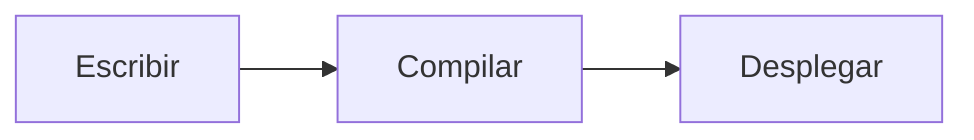

Ode es un sistema de publicación personal construido sobre Next.js 16 App Router. Está diseñado alrededor de una premisa: tu contenido son archivos de texto plano en un repositorio Git, y el sitio es una exportación de HTML estático que puede ejecutarse en cualquier lugar.

Este artículo es a la vez documentación e informe de campo. Cubre todo, desde la arquitectura hasta el despliegue y el flujo de escritura diario.

## Qué es Ode

Ode no es un CMS con un panel de control. No hay panel de administración, no hay base de datos, no hay página de inicio de sesión. En su lugar:

- Las entradas son **archivos MDX** almacenados en carpetas `posts/YYYY/slug/`
- La configuración es un único archivo **`config.ini`** en la raíz del proyecto
- Todo el sitio se compila en **HTML estático** con `npm run build`
- El directorio de salida (`out/`) puede cargarse a cualquier proveedor de hosting estático

La pila tecnológica es deliberadamente mínima:

| Capa | Tecnología |
|---|---|
| Framework | Next.js 16 App Router |
| Contenido | MDX a través de `next-mdx-remote` |
| Resaltado de sintaxis | `rehype-highlight` (tema Gruvbox oscuro) |
| Matemáticas | KaTeX a través de `remark-math` + `rehype-katex` |
| Diagramas | Mermaid (del lado del cliente) |
| Estilos | CSS artesanal, paleta de papel cálido |
| Tipografía | Iosevka Aile (mono), Schibsted Grotesk (cuerpo), Podkova (títulos) |
| Despliegue | Exportación estática — cualquier CDN o alojamiento de archivos |

## Estructura del proyecto

```
Ode/
├── config.ini              # Configuración del sitio
├── posts/
│   └── 2026/
│       └── mi-entrada/
│           ├── en.mdx      # Idioma por defecto (inglés)
│           ├── zh.mdx      # Traducción al chino
│           └── ar.mdx      # Traducción al árabe
├── public/                 # Recursos estáticos (imágenes, favicon)
├── src/
│   ├── app/                # Páginas y rutas de Next.js App Router
│   ├── components/         # Componentes React
│   └── lib/                # posts.ts, config.ts, i18n.ts …
├── locales/
│   ├── en.yaml             # Cadenas de UI (inglés)
│   └── zh.yaml             # Cadenas de UI (chino)
└── scripts/
    └── post.mjs            # Gestor interactivo de entradas
```

## Escribir entradas

### Frontmatter

Cada entrada comienza con un bloque de frontmatter YAML:

```yaml
---
title: "Título de mi entrada"
date: 2026-04-16
category: Dev Log
eyebrow: Etiqueta opcional sobre el título
summary: Una frase descriptiva que aparece en los listados y etiquetas meta.
featured: false
lang: es
tags: [etiqueta-uno, etiqueta-dos]
---
```

### Funciones MDX

**Recuadros de aviso:**

```
:::note
Esto es una nota.
:::

:::warning
Cuidado.
:::

:::tip
Consejo útil.
:::

:::danger
Acción destructiva por delante.
:::
```

**Matemáticas (KaTeX):**

En línea: `$E = mc^2$`

En bloque:
```
$$
\int_{-\infty}^{\infty} e^{-x^2}\, dx = \sqrt{\pi}
$$
```

**Diagramas (Mermaid):**

````

````

### Entradas multilingües

Cada entrada vive en una carpeta. Añade un archivo de idioma para traducirla:

```
posts/2026/mi-entrada/
├── en.mdx   ← Por defecto, URL: /en/blog/2026/mi-entrada
├── zh.mdx   ← URL: /en/blog/2026/mi-entrada/zh
├── ru.mdx   ← URL: /en/blog/2026/mi-entrada/ru
└── ar.mdx   ← URL: /en/blog/2026/mi-entrada/ar
```

El banner de traducción aparece automáticamente en la parte superior de cada entrada. Los idiomas de derecha a izquierda (árabe, hebreo, persa, urdu) se detectan automáticamente y el artículo se renderiza con `dir="rtl"`.

## Gestión de entradas con `npm run post`

```bash
npm run post
```

**Crear una entrada** — la herramienta pregunta por título, slug, fecha, categoría, resumen, etiquetas y si es destacada. Crea `posts/YYYY/slug/en.mdx` con el frontmatter correcto.

**Añadir una traducción** — ejecuta `npm run post`, elige «新建博文», responde sí a «¿Es una traducción?», selecciona el original de la lista e introduce el código de idioma.

**Eliminar una entrada** — la herramienta lista todas las entradas agrupadas por idioma. Seleccionar una entrada elimina toda la carpeta con todas sus traducciones.

## Configuración

Edita `config.ini` para personalizar el sitio sin tocar ningún código:

```ini
[site]
name     = Ian
brand    = Ian
locale   = en
subtitle = GNU & Linux | Open Source | Pentest
url      = https://tusitio.com

[links]
1 = GitHub   | https://github.com/tu-usuario
2 = RSS Feed | /rss.xml

[disqus]
shortname =
```

## Desplegar Ode

Ode compila a un sitio completamente estático. La salida es una carpeta de archivos HTML, CSS y JS que funciona en cualquier servidor web o CDN sin dependencias del lado del servidor.

### Compilar la salida estática

```bash
npm run build
# Salida → out/ (≈ 20 MB para un sitio nuevo)
```

---

### Cloudflare Workers (Recomendado)

Cloudflare Workers sirve archivos estáticos a través de su CDN global.

**Opción A — Carga directa:**

1. Ve a [dash.cloudflare.com](https://dash.cloudflare.com) → **Workers & Pages**
2. Nueva aplicación → **Pages** → **Direct Upload**
3. Arrastra la carpeta `out/` al área de carga
4. Tu sitio estará en vivo en `*.pages.dev` en segundos

**Opción B — Integración con Git (despliegue automático al hacer push):**

Primero, añade `wrangler.toml` a la raíz del proyecto:

```toml
name = "ode"
compatibility_date = "2025-01-01"

[assets]
directory = "./out"
```

Luego conecta tu repositorio en el panel de Cloudflare:

1. **Workers & Pages** → **Crear** → **Conectar a Git**
2. Selecciona tu repositorio
3. Configura los parámetros de compilación:

| Parámetro | Valor |
|---|---|
| Comando de compilación | `npm run build` |
| Comando de despliegue | `npx wrangler deploy` |
| Directorio raíz | `/` |

Cada `git push` a la rama principal dispara una compilación y despliegue automáticos. Cloudflare ejecuta `npm run build`, luego `npx wrangler deploy` lee `wrangler.toml` y publica el directorio `out/` como activos estáticos.

:::tip
El plan gratuito de Cloudflare Workers incluye 100.000 solicitudes al día y distribución CDN global. Para un blog personal es efectivamente ilimitado.
:::

---

### Railway

1. Crea un nuevo proyecto en [railway.app](https://railway.app)
2. Conecta tu repositorio de GitHub
3. Railway detecta Next.js automáticamente

:::note
Al desplegar en Railway, comenta `output: "export"` en `next.config.ts` — Railway ejecuta un servidor Node.js en vivo, no archivos estáticos.
:::

---

### GitHub Pages

Crea `.github/workflows/deploy.yml`:

```yaml
name: Desplegar en GitHub Pages
on:
  push:
    branches: [main]
jobs:
  deploy:
    runs-on: ubuntu-latest
    permissions:
      contents: read
      pages: write
      id-token: write
    steps:
      - uses: actions/checkout@v4
      - uses: actions/setup-node@v4
        with:
          node-version: 20
      - run: npm ci
      - run: npm run build
      - uses: actions/upload-pages-artifact@v3
        with:
          path: out/
      - uses: actions/deploy-pages@v4
```

:::warning
GitHub Pages en el plan gratuito solo admite repositorios públicos. Los repositorios privados requieren GitHub Pro o usar otra plataforma de alojamiento.
:::

---

### Netlify

1. Arrastra la carpeta `out/` a [app.netlify.com/drop](https://app.netlify.com/drop), o
2. Conecta tu repositorio Git y configura:
   - Comando de compilación: `npm run build`
   - Directorio de publicación: `out`

---

### VPS / Autoalojado

```nginx
server {
    listen 80;
    server_name tudominio.com;
    root /var/www/ode/out;
    index index.html;
    location / {
        try_files $uri $uri/ $uri.html =404;
    }
}
```

## Feeds

Ode genera dos feeds legibles por máquinas en tiempo de compilación:

| Formato | URL | Uso |
|---|---|---|
| RSS 2.0 | `/rss.xml` | Lectores de feeds (Feedly, NetNewsWire …) |
| JSONFeed 1.1 | `/feed.json` | Lectores modernos, scripts |

## Resumen

Ode es intencionalmente pequeño. El objetivo es un sitio fácil de entender de principio a fin, fácil de mover entre servidores y diseñado para durar. Texto plano como entrada, HTML estático como salida.

```
Escribir MDX → git push → npm run build → subir out/
```

Eso es todo el proceso.
