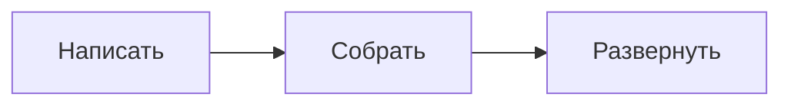

Ode — это система личных публикаций на основе Next.js 16 App Router. Она построена вокруг одной идеи: ваш контент — это обычные текстовые файлы в Git-репозитории, а сайт — это статический HTML-экспорт, который можно запустить где угодно.

Этот пост одновременно является документацией и отчётом с мест. Он охватывает всё — от архитектуры до развёртывания и ежедневного рабочего процесса написания.

## Что такое Ode

Ode — это не CMS с панелью управления. Нет административной панели, нет базы данных, нет страницы входа. Вместо этого:

- Посты — это **MDX-файлы** в папках `posts/YYYY/slug/`
- Конфигурация — единственный файл **`config.ini`** в корне проекта
- Весь сайт компилируется в **статический HTML** командой `npm run build`
- Выходную директорию (`out/`) можно загрузить к любому провайдеру статического хостинга

Стек намеренно минималистичен:

| Уровень | Технология |
|---|---|
| Фреймворк | Next.js 16 App Router |
| Контент | MDX через `next-mdx-remote` |
| Подсветка синтаксиса | `rehype-highlight` (тема Gruvbox dark) |
| Математика | KaTeX через `remark-math` + `rehype-katex` |
| Диаграммы | Mermaid (на стороне клиента) |
| Стили | Рукописный CSS, палитра тёплой бумаги |
| Шрифты | Iosevka Aile (моно), Schibsted Grotesk (текст), Podkova (заголовки) |
| Развёртывание | Статический экспорт — любой CDN или файловый хостинг |

## Структура проекта

```
Ode/
├── config.ini              # Общие настройки сайта
├── posts/
│   └── 2026/
│       └── my-post/
│           ├── en.mdx      # Основной язык (английский)
│           ├── zh.mdx      # Перевод на китайский
│           └── ar.mdx      # Перевод на арабский
├── public/                 # Статические ресурсы (изображения, favicon)
├── src/
│   ├── app/                # Страницы и маршруты Next.js App Router
│   ├── components/         # React-компоненты
│   └── lib/                # posts.ts, config.ts, i18n.ts …
├── locales/
│   ├── en.yaml             # UI-строки (английский)
│   └── zh.yaml             # UI-строки (китайский)
└── scripts/
    └── post.mjs            # Интерактивный менеджер постов
```

## Написание постов

### Метаданные (Frontmatter)

Каждый пост начинается с блока YAML frontmatter:

```yaml
---
title: "Заголовок поста"
date: 2026-04-16
category: Dev Log
eyebrow: Опциональная метка над заголовком
summary: Одно предложение, отображаемое в списках и мета-тегах.
featured: false
lang: ru
tags: [тег-один, тег-два]
---
```

### MDX-возможности

**Блоки предупреждений:**

```
:::note
Это заметка.
:::

:::warning
Осторожно.
:::

:::tip
Полезный совет.
:::

:::danger
Впереди опасное действие.
:::
```

**Математика (KaTeX):**

Встроенная: `$E = mc^2$`

Блочная:
```
$$
\int_{-\infty}^{\infty} e^{-x^2}\, dx = \sqrt{\pi}
$$
```

**Диаграммы (Mermaid):**

````

````

### Многоязычные посты

Каждый пост живёт в папке. Добавьте языковой файл для перевода:

```
posts/2026/my-post/
├── en.mdx   ← По умолчанию, URL: /en/blog/2026/my-post
├── zh.mdx   ← URL: /en/blog/2026/my-post/zh
├── ru.mdx   ← URL: /en/blog/2026/my-post/ru
└── ar.mdx   ← URL: /en/blog/2026/my-post/ar
```

Баннер перевода автоматически появляется вверху каждого поста. Языки с письмом справа налево (арабский, иврит, персидский, урду) определяются автоматически и статья рендерится с `dir="rtl"`.

## Управление постами через `npm run post`

```bash
npm run post
```

**Создать пост** — инструмент спрашивает заголовок, slug, дату, категорию, краткое описание, теги и является ли пост избранным. Создаёт `posts/YYYY/slug/en.mdx` с правильными метаданными.

**Добавить перевод** — запустите `npm run post`, выберите «新建博文», ответьте «да» на вопрос о переводе, выберите оригинал из списка и введите языковой код.

**Удалить пост** — инструмент выводит список всех постов сгруппированных по языкам. Выбор поста удаляет всю папку вместе со всеми переводами.

## Конфигурация

Отредактируйте `config.ini`, чтобы настроить сайт без изменения кода:

```ini
[site]
name     = Иван
brand    = Иван
locale   = en
subtitle = GNU & Linux | Open Source | Pentest
url      = https://yoursite.com

[links]
1 = GitHub   | https://github.com/you
2 = RSS Feed | /rss.xml

[disqus]
shortname =
```

## Развёртывание Ode

### Сборка статического вывода

```bash
npm run build
# Вывод → out/ (≈ 20 МБ для нового сайта)
```

---

### Cloudflare Pages (Рекомендуется)

**Вариант А — Прямая загрузка:**

1. Откройте [pages.cloudflare.com](https://pages.cloudflare.com)
2. Новый проект → **Direct Upload**
3. Перетащите папку `out/` в зону загрузки

**Вариант Б — Интеграция с Git:**

Настройки сборки:
```
Команда сборки:   npm run build
Выходная директория: out
Версия Node.js: 20
```

:::tip
Бесплатный тариф Cloudflare Pages включает 500 сборок в месяц и неограниченную пропускную способность.
:::

---

### Railway

1. Создайте новый проект на [railway.app](https://railway.app)
2. Подключите ваш GitHub-репозиторий
3. Railway автоматически определяет Next.js

:::note
При развёртывании на Railway закомментируйте `output: "export"` в `next.config.ts` — Railway запускает живой Node.js-сервер.
:::

---

### GitHub Pages

Создайте `.github/workflows/deploy.yml`:

```yaml
name: Deploy to GitHub Pages
on:
  push:
    branches: [main]
jobs:
  deploy:
    runs-on: ubuntu-latest
    permissions:
      contents: read
      pages: write
      id-token: write
    steps:
      - uses: actions/checkout@v4
      - uses: actions/setup-node@v4
        with:
          node-version: 20
      - run: npm ci
      - run: npm run build
      - uses: actions/upload-pages-artifact@v3
        with:
          path: out/
      - uses: actions/deploy-pages@v4
```

---

### VPS / Самостоятельный хостинг

```nginx
server {
    listen 80;
    server_name yourdomain.com;
    root /var/www/ode/out;
    index index.html;
    location / {
        try_files $uri $uri/ $uri.html =404;
    }
}
```

## Итог

Ode намеренно небольшой. Цель — сайт, понятный от начала до конца, легко переносимый между хостингами и рассчитанный на долгую жизнь. Простой текст на входе, статический HTML на выходе.

```
Написать MDX → git push → npm run build → загрузить out/
```

Это весь конвейер.
