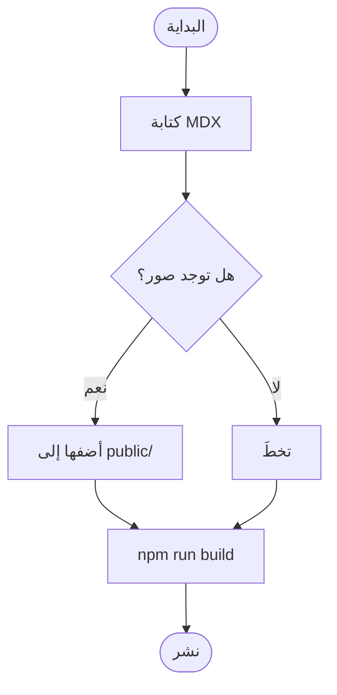
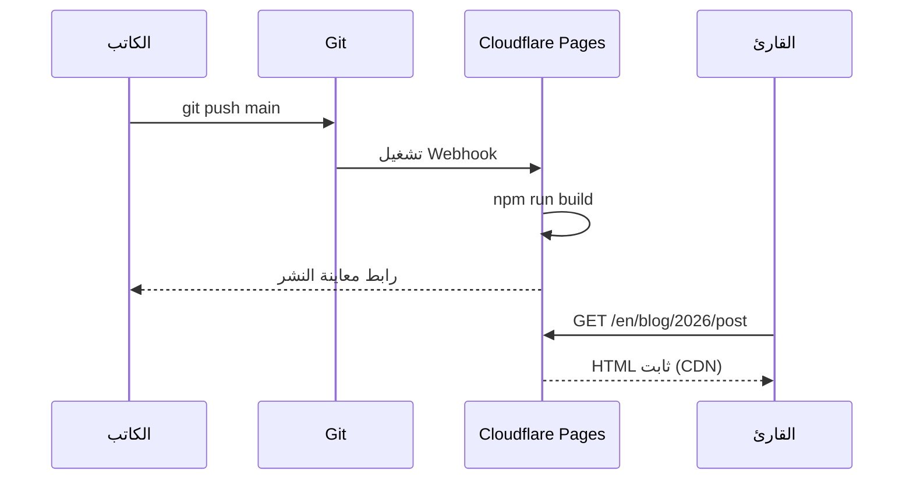
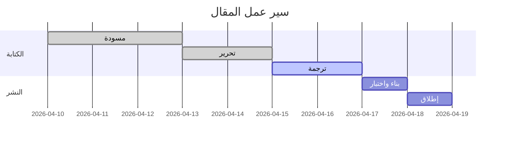

هذا المقال عرض توضيحي حي لكل ما يمكنك كتابته في Ode. احتفظ به كمرجع أثناء الكتابة.

## تنسيق النص

النص العادي يُكتب كنص عادي. الأسطر الفارغة تنشئ فقرات جديدة.

**غامق** يُكتب بـ `**نجمتين**`.
*مائل* يُكتب بـ `*نجمة واحدة*`.
~~يتوسطه خط~~ يُكتب بـ `~~مد~~`.
`كود سطري` يُكتب بـ `` `علامات اقتباس خلفية` ``.
**يمكنك _الجمع بينها_** بحرية.

روابط: [Ode on GitHub](https://github.com/itworksig/Ode)

---

## العناوين

```
## H2 — عنوان قسم
### H3 — عنوان قسم فرعي
```

يظهر H2 في الشريط الجانبي **جدول المحتويات** على الشاشات العريضة. يظهر H3 بمسافة بادئة تحت H2 الأصل.

---

## القوائم

**غير مرتبة:**

- العنصر الأول
- العنصر الثاني
  - عنصر متداخل
  - عنصر متداخل آخر
- العنصر الثالث

**مرتبة:**

1. تثبيت Node.js 20
2. استنساخ المستودع
3. تشغيل `npm install`
4. تشغيل `npm run dev`

**قائمة مهام:**

- [x] كتابة المقال
- [x] إضافة الترجمات
- [ ] النشر على Cloudflare Pages

---

## اقتباس

> أفضل الكتابة هي إعادة الكتابة.
>
> — E.B. White

---

## الجداول

تستخدم الجداول صياغة الأنبوب من GitHub Flavored Markdown:

```
| العمود أ | العمود ب | العمود ج |
|---|---|---|
| الصف 1   | بيانات   | المزيد   |
| الصف 2   | بيانات   | المزيد   |
```

**النتيجة:**

| المنصة | الخطة المجانية | نطاق مخصص | نشر تلقائي |
|---|---|---|---|
| Cloudflare Pages | ✓ نطاق ترددي غير محدود | ✓ | ✓ Git push |
| GitHub Pages | ✓ المستودعات العامة | ✓ | ✓ Actions |
| Netlify | ✓ 100 غيغابايت/شهر | ✓ | ✓ Git push |
| Railway | ✓ رصيد $5/شهر | ✓ | ✓ Git push |
| VPS (Nginx) | — (بتكلفة) | ✓ | يدوي |

---

## الصور

ضع ملف الصورة في مجلد `public/` (أو مجلد فرعي)، ثم أشر إليه في MDX:

```mdx

```

**النتيجة:**


تُقيَّد الصور تلقائياً بعرض العمود (`max-width: 100%`). استخدم نصاً بديلاً وصفياً لإمكانية الوصول.

**مع تعليق** (استخدم اقتباساً أسفل الصورة):

```mdx


> *الشكل 1 — الجيب (أخضر) والجيب تمام (أزرق) على دورتين.*
```


> *الشكل 1 — الجيب (أخضر) والجيب تمام (أزرق) على دورتين.*

---

## كتل الكود

تستخدم كتل الكود المسيَّجة ثلاث علامات اقتباس خلفية ومعرِّف اللغة لتمييز الصياغة. مرر المؤشر فوق أي كتلة لإظهار زر **نسخ**.

**TypeScript:**

```typescript
interface Post {
  slug: string;
  title: string;
  date: string;
  tags: string[];
}

async function getPost(slug: string): Promise<Post | null> {
  const res = await fetch(`/api/posts/${slug}`);
  if (!res.ok) return null;
  return res.json();
}
```

**Bash:**

```bash
# بناء وعرض الموقع الثابت مسبقاً
npm run build
npx serve out

# إنشاء مقال جديد بشكل تفاعلي
npm run post
```

**Python:**

```python
def fibonacci(n: int, memo: dict = {}) -> int:
    if n <= 1:
        return n
    if n not in memo:
        memo[n] = fibonacci(n - 1) + fibonacci(n - 2)
    return memo[n]

print([fibonacci(i) for i in range(10)])
# [0, 1, 1, 2, 3, 5, 8, 13, 21, 34]
```

---

## الرياضيات — KaTeX

يُقدِّم Ode الرياضيات باستخدام KaTeX في وقت البناء. لا يلزم JavaScript لعرض الصيغ.

### رياضيات سطرية

اجعلها بين علامتي دولار واحدة: `$الصيغة$`

نُشرت معادلة تكافؤ الطاقة والكتلة $E = mc^2$ على يد أينشتاين عام 1905. ثابت الدائرة $\tau = 2\pi \approx 6.283$.

### رياضيات في كتلة

اجعلها بين علامتي دولار مزدوجتين في سطور منفصلة:

```
$$
\sum_{n=1}^{\infty} \frac{1}{n^2} = \frac{\pi^2}{6}
$$
```

$$
\sum_{n=1}^{\infty} \frac{1}{n^2} = \frac{\pi^2}{6}
$$

أمثلة إضافية:

$$
\lim_{x \to 0} \frac{\sin x}{x} = 1
$$

$$
\mathbf{F} = m\mathbf{a}, \qquad
\oint_{\partial \Omega} \mathbf{F} \cdot d\mathbf{s} = \iint_{\Omega} (\nabla \times \mathbf{F}) \cdot d\mathbf{A}
$$

$$
e^{i\theta} = \cos\theta + i\sin\theta
$$

---

## المخططات — Mermaid

افتح كتلة مسيَّجة بعلامة اللغة `mermaid`. يُقدَّم المخطط من جانب العميل عند تحميل الصفحة.

### مخطط انسيابي



### مخطط تسلسل



### مخطط غانت



---

## صناديق التنبيه

يحتوي Ode على ستة أنواع مدمجة من التنبيهات. اكتبها باستخدام أسوار النقطتين الثلاثية:

```
:::note
النص هنا.
:::
```

:::note
**ملاحظة** — استخدم للمعلومات التكميلية التي قد يجدها القارئ مفيدة لكن يمكنه تخطيها.
:::

:::info
**معلومة** — استخدم للسياق الواقعي أو الخلفية الداعمة للنقطة الرئيسية.
:::

:::tip
**نصيحة** — استخدم للنصائح العملية أو الاختصارات أو توصيات أفضل الممارسات.
:::

:::warning
**تحذير** — استخدم عندما قد يسوء الأمر إذا لم يكن القارئ حذراً.
:::

:::danger
**خطر** — استخدم للإجراءات التي لا رجعة فيها أو المدمرة. احتفظ به بشكل نادر.
:::

:::stale 2025-06-01
**قديم** — استخدم للأقسام التي قد تكون قديمة. يُحدد التاريخ آخر وقت تم فيه التحقق من المحتوى. آخر تحقق من هذه الكتلة كان في 2025-06-01.
:::

---

## خط أفقي

ثلاث شرطات أو أكثر في سطرها الخاص:

```
---
```

ينشئ الفاصل الذي تراه بين الأقسام في هذا المقال.

---

## بطاقة مرجع سريع

| الميزة | الصياغة |
|---|---|
| غامق | `**نص**` |
| مائل | `*نص*` |
| كود سطري | `` `كود` `` |
| رابط | `[تسمية](url)` |
| صورة | `` |
| رياضيات سطرية | `$E = mc^2$` |
| رياضيات كتلة | `$$` في سطرها الخاص |
| كتلة كود | `` ```lang `` |
| مخطط Mermaid | `` ```mermaid `` |
| صندوق ملاحظة | `:::note` |
| صندوق تحذير | `:::warning` |
| صندوق نصيحة | `:::tip` |
| صندوق خطر | `:::danger` |
| صندوق قديم | `:::stale YYYY-MM-DD` |
| خط أفقي | `---` |
| جدول | `\| عمود \| عمود \|` |
