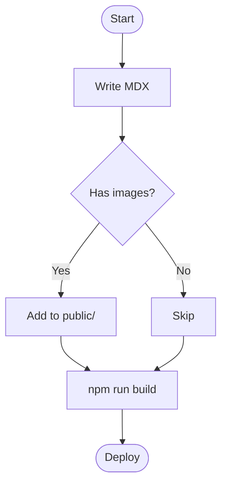
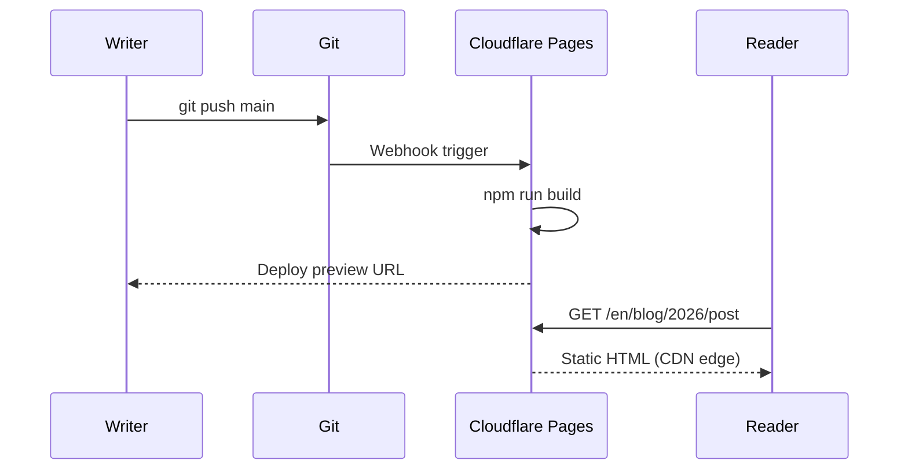
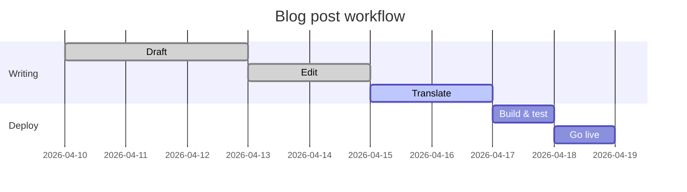

This post is a live demonstration of everything you can write in Ode. Keep it bookmarked as a reference while you write.

## Text Formatting

Regular prose is written as plain text. Blank lines create new paragraphs.

**Bold** is written with `**double asterisks**`.
*Italic* is written with `*single asterisks*`.
~~Strikethrough~~ is written with `~~tildes~~`.
`Inline code` is written with `` `backticks` ``.
**You can _combine_ them** freely.

Links: [Ode on GitHub](https://github.com/itworksig/Ode)

---

## Headings

```
## H2 — Section heading
### H3 — Subsection heading
```

H2 appears in the **Table of Contents** sidebar on wide screens. H3 is indented below its parent H2.

---

## Lists

**Unordered:**

- First item
- Second item
  - Nested item
  - Another nested item
- Third item

**Ordered:**

1. Install Node.js 20
2. Clone the repository
3. Run `npm install`
4. Run `npm run dev`

**Task list:**

- [x] Write the post
- [x] Add translations
- [ ] Deploy to Cloudflare Pages

---

## Blockquote

> The best writing is rewriting.
>
> — E.B. White

---

## Tables

Tables use the GitHub Flavored Markdown pipe syntax:

```
| Column A | Column B | Column C |
|---|---|---|
| Row 1    | Data     | More     |
| Row 2    | Data     | More     |
```

**Result:**

| Platform | Free tier | Custom domain | Auto-deploy |
|---|---|---|---|
| Cloudflare Pages | ✓ Unlimited bandwidth | ✓ | ✓ Git push |
| GitHub Pages | ✓ Public repos | ✓ | ✓ Actions |
| Netlify | ✓ 100 GB/month | ✓ | ✓ Git push |
| Railway | ✓ $5 credit/month | ✓ | ✓ Git push |
| VPS (Nginx) | — (you pay) | ✓ | Manual |

---

## Images

Place your image file in the `public/` folder (or a subfolder), then reference it in MDX:

```mdx

```

**Result:**


Images are automatically constrained to the column width (`max-width: 100%`). Use descriptive alt text for accessibility.

**With a caption** (use a blockquote below the image):

```mdx


> *Figure 1 — Sine (green) and cosine (blue) plotted over two periods.*
```


> *Figure 1 — Sine (green) and cosine (blue) plotted over two periods.*

---

## Code Blocks

Fenced code blocks use triple backticks and a language identifier for syntax highlighting. Hover over any block to reveal the **Copy** button.

**TypeScript:**

```typescript
interface Post {
  slug: string;
  title: string;
  date: string;
  tags: string[];
}

async function getPost(slug: string): Promise<Post | null> {
  const res = await fetch(`/api/posts/${slug}`);
  if (!res.ok) return null;
  return res.json();
}
```

**Bash:**

```bash
# Build and preview the static site
npm run build
npx serve out

# Create a new post interactively
npm run post
```

**Python:**

```python
def fibonacci(n: int, memo: dict = {}) -> int:
    if n <= 1:
        return n
    if n not in memo:
        memo[n] = fibonacci(n - 1) + fibonacci(n - 2)
    return memo[n]

print([fibonacci(i) for i in range(10)])
# [0, 1, 1, 2, 3, 5, 8, 13, 21, 34]
```

**YAML / INI / JSON** (no highlighting, displayed as plain text):

```yaml
site:
  name: Ian
  url: https://example.com
```

---

## Math — KaTeX

Ode renders math using KaTeX at build time. No JavaScript required to display formulas.

### Inline Math

Wrap with single dollar signs: `$formula$`

The energy–mass equivalence $E = mc^2$ was published by Einstein in 1905. The circle constant $\tau = 2\pi \approx 6.283$.

### Block Math

Wrap with double dollar signs on their own lines:

```
$$
\sum_{n=1}^{\infty} \frac{1}{n^2} = \frac{\pi^2}{6}
$$
```

$$
\sum_{n=1}^{\infty} \frac{1}{n^2} = \frac{\pi^2}{6}
$$

More examples:

$$
\lim_{x \to 0} \frac{\sin x}{x} = 1
$$

$$
\mathbf{F} = m\mathbf{a}, \qquad
\oint_{\partial \Omega} \mathbf{F} \cdot d\mathbf{s} = \iint_{\Omega} (\nabla \times \mathbf{F}) \cdot d\mathbf{A}
$$

$$
e^{i\theta} = \cos\theta + i\sin\theta
$$

---

## Diagrams — Mermaid

Open a fenced block with the language tag `mermaid`. The diagram renders client-side on page load.

### Flowchart



### Sequence Diagram



### Gantt Chart



---

## Admonition Boxes

Ode has six built-in admonition types. Write them with triple-colon fences:

```
:::note
Text here.
:::
```

:::note
**Note** — Use for supplemental information the reader might find helpful but can skip.
:::

:::info
**Info** — Use for factual context or background that supports the main point.
:::

:::tip
**Tip** — Use for practical advice, shortcuts, or best-practice recommendations.
:::

:::warning
**Warning** — Use when something might go wrong if the reader isn't careful.
:::

:::danger
**Danger** — Use for irreversible or destructive actions. Reserve sparingly.
:::

:::stale 2025-06-01
**Stale** — Use for sections that may be outdated. The date argument marks when the content was last verified. This block was last checked on 2025-06-01.
:::

---

## Horizontal Rule

Three or more dashes on their own line:

```
---
```

Creates the divider you see between sections in this post.

---

## Quick Reference Card

| Feature | Syntax |
|---|---|
| Bold | `**text**` |
| Italic | `*text*` |
| Inline code | `` `code` `` |
| Link | `[label](url)` |
| Image | `` |
| Inline math | `$E = mc^2$` |
| Block math | `$$` on its own line |
| Code block | `` ```lang `` |
| Mermaid diagram | `` ```mermaid `` |
| Note box | `:::note` |
| Warning box | `:::warning` |
| Tip box | `:::tip` |
| Danger box | `:::danger` |
| Stale box | `:::stale YYYY-MM-DD` |
| Horizontal rule | `---` |
| Table | `\| col \| col \|` |
