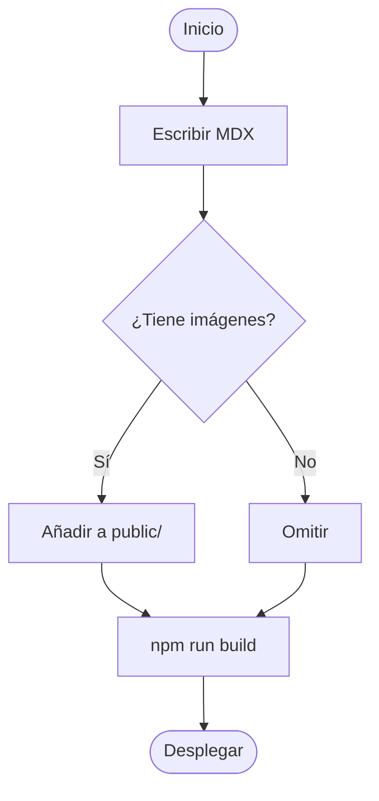
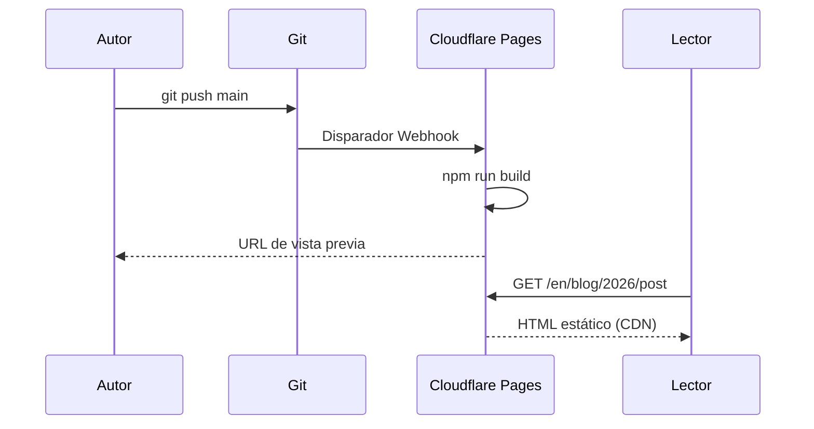
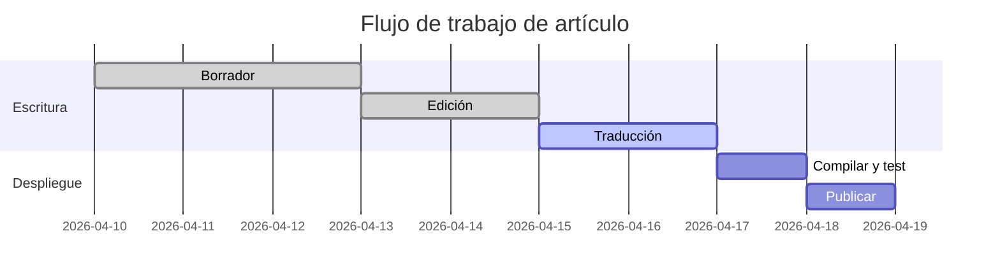

Este artículo es una demostración en vivo de todo lo que puedes escribir en Ode. Guárdalo como referencia mientras escribes.

## Formato de texto

El texto normal se escribe como texto plano. Las líneas en blanco crean nuevos párrafos.

**Negrita** se escribe con `**dobles asteriscos**`.
*Cursiva* se escribe con `*asteriscos simples*`.
~~Tachado~~ se escribe con `~~tildes~~`.
`Código en línea` se escribe con `` `comillas invertidas` ``.
**Se pueden _combinar_** libremente.

Enlaces: [Ode on GitHub](https://github.com/itworksig/Ode)

---

## Encabezados

```
## H2 — Encabezado de sección
### H3 — Encabezado de subsección
```

H2 aparece en la barra lateral de la **Tabla de contenidos** en pantallas anchas. H3 aparece sangrado bajo su H2 padre.

---

## Listas

**Sin ordenar:**

- Primer elemento
- Segundo elemento
  - Elemento anidado
  - Otro elemento anidado
- Tercer elemento

**Ordenada:**

1. Instalar Node.js 20
2. Clonar el repositorio
3. Ejecutar `npm install`
4. Ejecutar `npm run dev`

**Lista de tareas:**

- [x] Escribir el artículo
- [x] Añadir traducciones
- [ ] Desplegar en Cloudflare Pages

---

## Cita en bloque

> La mejor escritura es la reescritura.
>
> — E.B. White

---

## Tablas

Las tablas usan la sintaxis de tubería de GitHub Flavored Markdown:

```
| Columna A | Columna B | Columna C |
|---|---|---|
| Fila 1    | Datos     | Más       |
| Fila 2    | Datos     | Más       |
```

**Resultado:**

| Plataforma | Plan gratuito | Dominio propio | Auto-despliegue |
|---|---|---|---|
| Cloudflare Pages | ✓ Ancho de banda ilimitado | ✓ | ✓ Git push |
| GitHub Pages | ✓ Repos públicos | ✓ | ✓ Actions |
| Netlify | ✓ 100 GB/mes | ✓ | ✓ Git push |
| Railway | ✓ $5 créditos/mes | ✓ | ✓ Git push |
| VPS (Nginx) | — (de pago) | ✓ | Manual |

---

## Imágenes

Coloca el archivo de imagen en la carpeta `public/` (o una subcarpeta), luego referéncialo en MDX:

```mdx

```

**Resultado:**


Las imágenes se limitan automáticamente al ancho de columna (`max-width: 100%`). Usa texto alternativo descriptivo para la accesibilidad.

**Con pie de foto** (usa una cita en bloque debajo de la imagen):

```mdx


> *Figura 1 — Seno (verde) y coseno (azul) trazados en dos períodos.*
```


> *Figura 1 — Seno (verde) y coseno (azul) trazados en dos períodos.*

---

## Bloques de código

Los bloques de código delimitados usan triple comilla invertida e identificador de lenguaje para el resaltado de sintaxis. Pasa el cursor sobre cualquier bloque para revelar el botón **Copiar**.

**TypeScript:**

```typescript
interface Post {
  slug: string;
  title: string;
  date: string;
  tags: string[];
}

async function getPost(slug: string): Promise<Post | null> {
  const res = await fetch(`/api/posts/${slug}`);
  if (!res.ok) return null;
  return res.json();
}
```

**Bash:**

```bash
# Compilar y previsualizar el sitio estático
npm run build
npx serve out

# Crear un nuevo artículo de forma interactiva
npm run post
```

**Python:**

```python
def fibonacci(n: int, memo: dict = {}) -> int:
    if n <= 1:
        return n
    if n not in memo:
        memo[n] = fibonacci(n - 1) + fibonacci(n - 2)
    return memo[n]

print([fibonacci(i) for i in range(10)])
# [0, 1, 1, 2, 3, 5, 8, 13, 21, 34]
```

---

## Matemáticas — KaTeX

Ode renderiza matemáticas usando KaTeX en tiempo de compilación. No se necesita JavaScript para mostrar fórmulas.

### Matemáticas en línea

Envuelve con signos de dólar simples: `$fórmula$`

La equivalencia energía-masa $E = mc^2$ fue publicada por Einstein en 1905. La constante circular $\tau = 2\pi \approx 6.283$.

### Matemáticas en bloque

Envuelve con dobles signos de dólar en sus propias líneas:

```
$$
\sum_{n=1}^{\infty} \frac{1}{n^2} = \frac{\pi^2}{6}
$$
```

$$
\sum_{n=1}^{\infty} \frac{1}{n^2} = \frac{\pi^2}{6}
$$

Más ejemplos:

$$
\lim_{x \to 0} \frac{\sin x}{x} = 1
$$

$$
\mathbf{F} = m\mathbf{a}, \qquad
\oint_{\partial \Omega} \mathbf{F} \cdot d\mathbf{s} = \iint_{\Omega} (\nabla \times \mathbf{F}) \cdot d\mathbf{A}
$$

$$
e^{i\theta} = \cos\theta + i\sin\theta
$$

---

## Diagramas — Mermaid

Abre un bloque delimitado con la etiqueta de lenguaje `mermaid`. El diagrama se renderiza en el lado del cliente al cargar la página.

### Diagrama de flujo



### Diagrama de secuencia



### Diagrama de Gantt



---

## Recuadros de aviso

Ode tiene seis tipos de avisos incorporados. Escríbelos con cercas de triple dos puntos:

```
:::note
Texto aquí.
:::
```

:::note
**Nota** — Usa para información complementaria que el lector puede encontrar útil pero puede omitir.
:::

:::info
**Info** — Usa para contexto factual o antecedentes que apoyan el punto principal.
:::

:::tip
**Consejo** — Usa para consejos prácticos, atajos o recomendaciones de buenas prácticas.
:::

:::warning
**Advertencia** — Usa cuando algo podría salir mal si el lector no tiene cuidado.
:::

:::danger
**Peligro** — Usa para acciones irreversibles o destructivas. Reserva con moderación.
:::

:::stale 2025-06-01
**Desactualizado** — Usa para secciones que pueden estar desactualizadas. La fecha indica cuándo se verificó por última vez. Este bloque fue verificado por última vez el 2025-06-01.
:::

---

## Regla horizontal

Tres o más guiones en su propia línea:

```
---
```

Crea el divisor que ves entre secciones en este artículo.

---

## Tarjeta de referencia rápida

| Función | Sintaxis |
|---|---|
| Negrita | `**texto**` |
| Cursiva | `*texto*` |
| Código en línea | `` `código` `` |
| Enlace | `[etiqueta](url)` |
| Imagen | `` |
| Matemáticas en línea | `$E = mc^2$` |
| Matemáticas en bloque | `$$` en su propia línea |
| Bloque de código | `` ```lang `` |
| Diagrama Mermaid | `` ```mermaid `` |
| Recuadro nota | `:::note` |
| Recuadro advertencia | `:::warning` |
| Recuadro consejo | `:::tip` |
| Recuadro peligro | `:::danger` |
| Recuadro desactualizado | `:::stale YYYY-MM-DD` |
| Regla horizontal | `---` |
| Tabla | `\| col \| col \|` |
