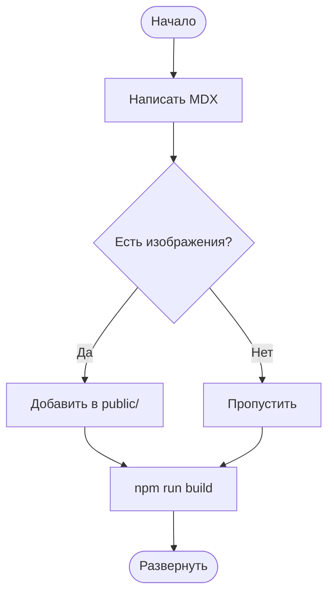
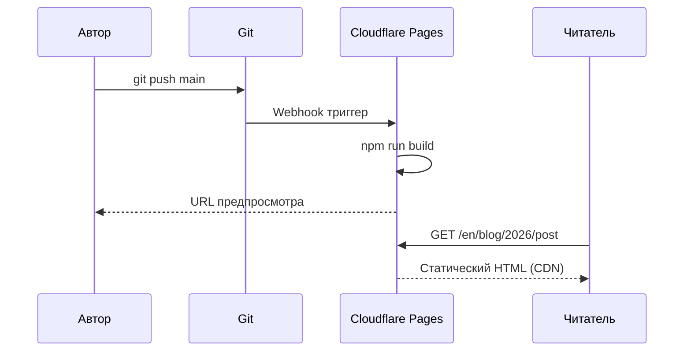
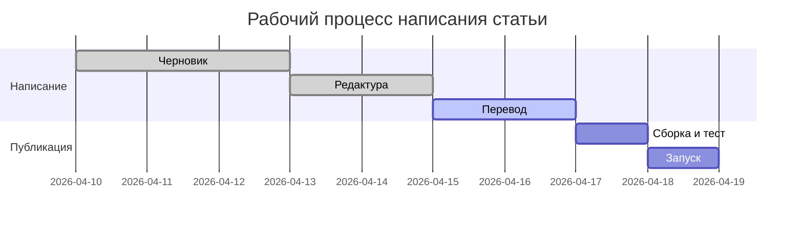

Эта статья — живая демонстрация всего, что можно написать в Ode. Держите её под рукой как справочник во время работы.

## Форматирование текста

Обычный текст пишется без разметки. Пустые строки создают новые абзацы.

**Жирный** текст пишется с помощью `**двойных звёздочек**`.
*Курсив* пишется с помощью `*одинарных звёздочек*`.
~~Зачёркнутый~~ текст пишется с помощью `~~тильд~~`.
`Строчный код` пишется с помощью `` `обратных кавычек` ``.
**Их можно _комбинировать_** свободно.

Ссылки: [Ode on GitHub](https://github.com/itworksig/Ode)

---

## Заголовки

```
## H2 — Заголовок раздела
### H3 — Заголовок подраздела
```

H2 появляется в боковой панели **Содержания** на широких экранах. H3 отображается с отступом под родительским H2.

---

## Списки

**Маркированный:**

- Первый пункт
- Второй пункт
  - Вложенный пункт
  - Ещё один вложенный
- Третий пункт

**Нумерованный:**

1. Установить Node.js 20
2. Клонировать репозиторий
3. Запустить `npm install`
4. Запустить `npm run dev`

**Список задач:**

- [x] Написать статью
- [x] Добавить переводы
- [ ] Развернуть на Cloudflare Pages

---

## Цитата

> Лучшее письмо — это переписывание.
>
> — E.B. White

---

## Таблицы

Таблицы используют синтаксис вертикальных черт GitHub Flavored Markdown:

```
| Столбец A | Столбец B | Столбец C |
|---|---|---|
| Строка 1  | Данные    | Ещё       |
| Строка 2  | Данные    | Ещё       |
```

**Результат:**

| Платформа | Бесплатный план | Свой домен | Авто-деплой |
|---|---|---|---|
| Cloudflare Pages | ✓ Без лимита | ✓ | ✓ Git push |
| GitHub Pages | ✓ Публичные репо | ✓ | ✓ Actions |
| Netlify | ✓ 100 ГБ/месяц | ✓ | ✓ Git push |
| Railway | ✓ $5 кредитов/месяц | ✓ | ✓ Git push |
| VPS (Nginx) | — (платно) | ✓ | Вручную |

---

## Изображения

Поместите файл изображения в папку `public/` (или подпапку), затем сошлитесь на него в MDX:

```mdx

```

**Результат:**


Изображения автоматически ограничиваются шириной колонки (`max-width: 100%`). Используйте описательный альтернативный текст для доступности.

**С подписью** (используйте блок цитаты под изображением):

```mdx


> *Рисунок 1 — Синус (зелёный) и косинус (синий) на двух периодах.*
```


> *Рисунок 1 — Синус (зелёный) и косинус (синий) на двух периодах.*

---

## Блоки кода

Ограждённые блоки кода используют тройные обратные кавычки и идентификатор языка для подсветки синтаксиса. Наведите курсор на любой блок, чтобы открыть кнопку **Копировать**.

**TypeScript:**

```typescript
interface Post {
  slug: string;
  title: string;
  date: string;
  tags: string[];
}

async function getPost(slug: string): Promise<Post | null> {
  const res = await fetch(`/api/posts/${slug}`);
  if (!res.ok) return null;
  return res.json();
}
```

**Bash:**

```bash
# Собрать и предпросмотреть статический сайт
npm run build
npx serve out

# Создать новую статью интерактивно
npm run post
```

**Python:**

```python
def fibonacci(n: int, memo: dict = {}) -> int:
    if n <= 1:
        return n
    if n not in memo:
        memo[n] = fibonacci(n - 1) + fibonacci(n - 2)
    return memo[n]

print([fibonacci(i) for i in range(10)])
# [0, 1, 1, 2, 3, 5, 8, 13, 21, 34]
```

---

## Математика — KaTeX

Ode рендерит математику с помощью KaTeX во время сборки. JavaScript не нужен для отображения формул.

### Строчная математика

Заключите в одинарные знаки доллара: `$формула$`

Эквивалентность энергии и массы $E = mc^2$ была опубликована Эйнштейном в 1905 году. Круговая постоянная $\tau = 2\pi \approx 6.283$.

### Блочная математика

Заключите в двойные знаки доллара на отдельных строках:

```
$$
\sum_{n=1}^{\infty} \frac{1}{n^2} = \frac{\pi^2}{6}
$$
```

$$
\sum_{n=1}^{\infty} \frac{1}{n^2} = \frac{\pi^2}{6}
$$

Ещё примеры:

$$
\lim_{x \to 0} \frac{\sin x}{x} = 1
$$

$$
\mathbf{F} = m\mathbf{a}, \qquad
\oint_{\partial \Omega} \mathbf{F} \cdot d\mathbf{s} = \iint_{\Omega} (\nabla \times \mathbf{F}) \cdot d\mathbf{A}
$$

$$
e^{i\theta} = \cos\theta + i\sin\theta
$$

---

## Диаграммы — Mermaid

Откройте ограждённый блок с тегом языка `mermaid`. Диаграмма рендерится на стороне клиента при загрузке страницы.

### Блок-схема



### Диаграмма последовательности



### Диаграмма Ганта



---

## Блоки предупреждений

В Ode есть шесть встроенных типов блоков. Пишите их с тройным двоеточием в качестве ограждения:

```
:::note
Текст здесь.
:::
```

:::note
**Примечание** — Используйте для дополнительной информации, которую читатель может пропустить.
:::

:::info
**Информация** — Используйте для фактического контекста или предыстории, поддерживающей основную мысль.
:::

:::tip
**Совет** — Используйте для практических рекомендаций, ярлыков или лучших практик.
:::

:::warning
**Предупреждение** — Используйте когда что-то может пойти не так, если читатель не будет осторожен.
:::

:::danger
**Опасность** — Используйте для необратимых или разрушительных действий. Используйте редко.
:::

:::stale 2025-06-01
**Устарело** — Используйте для разделов, которые могут быть устаревшими. Дата указывает время последней проверки. Этот блок последний раз проверялся 2025-06-01.
:::

---

## Горизонтальный разделитель

Три или более тире на отдельной строке:

```
---
```

Создаёт разделитель, который вы видите между разделами этой статьи.

---

## Краткая справочная карточка

| Функция | Синтаксис |
|---|---|
| Жирный | `**текст**` |
| Курсив | `*текст*` |
| Строчный код | `` `код` `` |
| Ссылка | `[подпись](url)` |
| Изображение | `` |
| Строчная математика | `$E = mc^2$` |
| Блочная математика | `$$` на отдельной строке |
| Блок кода | `` ```язык `` |
| Диаграмма Mermaid | `` ```mermaid `` |
| Блок примечания | `:::note` |
| Блок предупреждения | `:::warning` |
| Блок совета | `:::tip` |
| Блок опасности | `:::danger` |
| Блок устарело | `:::stale YYYY-MM-DD` |
| Разделитель | `---` |
| Таблица | `\| col \| col \|` |
