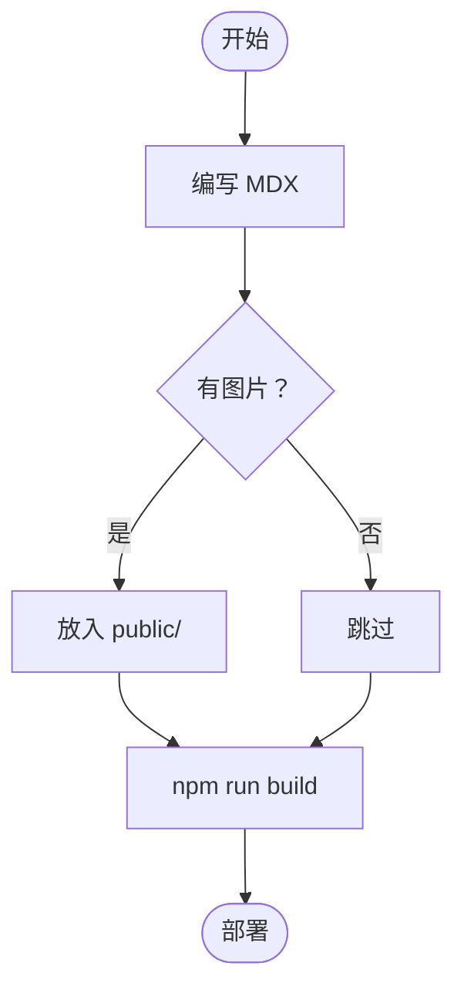
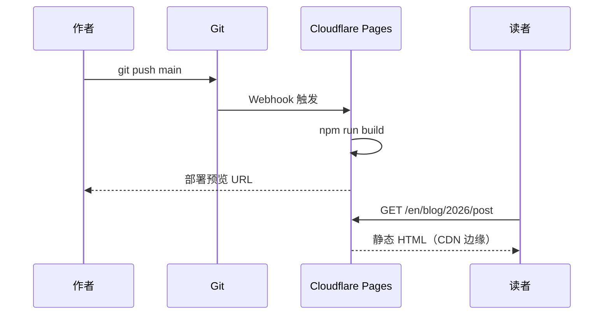
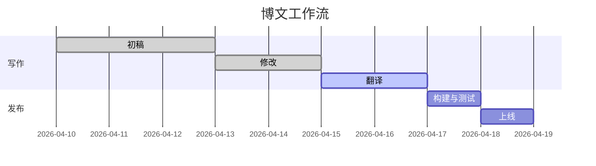

本文是 Ode 所有写作功能的实时演示。写作时可随时将此文作为参考手册。

## 文本格式

普通正文直接书写即可，空行产生新段落。

**粗体**用 `**双星号**` 书写。
*斜体*用 `*单星号*` 书写。
~~删除线~~用 `~~波浪号~~` 书写。
`行内代码`用 `` `反引号` `` 书写。
**可以_自由组合_**使用。

链接：[Ode on GitHub](https://github.com/itworksig/Ode)

---

## 标题

```
## H2 — 章节标题
### H3 — 小节标题
```

H2 会出现在宽屏侧边栏的**目录**中，H3 缩进在父级 H2 下方。

---

## 列表

**无序列表：**

- 第一项
- 第二项
  - 嵌套项
  - 另一个嵌套项
- 第三项

**有序列表：**

1. 安装 Node.js 20
2. 克隆仓库
3. 运行 `npm install`
4. 运行 `npm run dev`

**任务列表：**

- [x] 撰写文章
- [x] 添加翻译
- [ ] 部署到 Cloudflare Pages

---

## 引用块

> 最好的写作就是改写。
>
> — E.B. White

---

## 表格

表格使用 GitHub Flavored Markdown 的管道符语法：

```
| 列 A | 列 B | 列 C |
|---|---|---|
| 第1行 | 数据 | 更多 |
| 第2行 | 数据 | 更多 |
```

**效果：**

| 平台 | 免费套餐 | 自定义域名 | 自动部署 |
|---|---|---|---|
| Cloudflare Pages | ✓ 无限流量 | ✓ | ✓ Git 推送 |
| GitHub Pages | ✓ 公开仓库 | ✓ | ✓ Actions |
| Netlify | ✓ 100 GB/月 | ✓ | ✓ Git 推送 |
| Railway | ✓ $5 额度/月 | ✓ | ✓ Git 推送 |
| VPS (Nginx) | — （自费） | ✓ | 手动 |

---

## 图片

将图片文件放入 `public/` 文件夹（或子文件夹），然后在 MDX 中引用：

```mdx

```

**效果：**


图片会自动限制在列宽内（`max-width: 100%`）。请使用描述性替代文本以确保无障碍访问。

**带说明文字**（在图片下方使用引用块）：

```mdx


> *图1 — 正弦（绿色）和余弦（蓝色）在两个周期内的图形。*
```


> *图1 — 正弦（绿色）和余弦（蓝色）在两个周期内的图形。*

---

## 代码块

使用三个反引号加语言标识符开启代码块，可实现语法高亮。悬停在任意代码块上可显示**复制**按钮。

**TypeScript：**

```typescript
interface Post {
  slug: string;
  title: string;
  date: string;
  tags: string[];
}

async function getPost(slug: string): Promise<Post | null> {
  const res = await fetch(`/api/posts/${slug}`);
  if (!res.ok) return null;
  return res.json();
}
```

**Bash：**

```bash
# 构建并预览静态站点
npm run build
npx serve out

# 交互式创建新文章
npm run post
```

**Python：**

```python
def fibonacci(n: int, memo: dict = {}) -> int:
    if n <= 1:
        return n
    if n not in memo:
        memo[n] = fibonacci(n - 1) + fibonacci(n - 2)
    return memo[n]

print([fibonacci(i) for i in range(10)])
# [0, 1, 1, 2, 3, 5, 8, 13, 21, 34]
```

---

## 数学公式 — KaTeX

Ode 在构建时使用 KaTeX 渲染数学公式，无需 JavaScript 即可显示。

### 行内公式

用单美元符号包裹：`$公式$`

能量-质量等价关系 $E = mc^2$ 由爱因斯坦于1905年发表。圆常数 $\tau = 2\pi \approx 6.283$。

### 块级公式

用双美元符号单独成行包裹：

```
$$
\sum_{n=1}^{\infty} \frac{1}{n^2} = \frac{\pi^2}{6}
$$
```

$$
\sum_{n=1}^{\infty} \frac{1}{n^2} = \frac{\pi^2}{6}
$$

更多示例：

$$
\lim_{x \to 0} \frac{\sin x}{x} = 1
$$

$$
\mathbf{F} = m\mathbf{a}, \qquad
\oint_{\partial \Omega} \mathbf{F} \cdot d\mathbf{s} = \iint_{\Omega} (\nabla \times \mathbf{F}) \cdot d\mathbf{A}
$$

$$
e^{i\theta} = \cos\theta + i\sin\theta
$$

---

## 图表 — Mermaid

使用 `mermaid` 语言标签开启代码块，图表在页面加载时客户端渲染。

### 流程图



### 时序图



### 甘特图



---

## 提示框

Ode 内置六种提示框类型，使用三冒号围栏语法：

```
:::note
此处填写内容。
:::
```

:::note
**注意** — 用于读者可能觉得有帮助但可以跳过的补充信息。
:::

:::info
**信息** — 用于支持主要观点的事实背景或背景知识。
:::

:::tip
**提示** — 用于实用建议、快捷方式或最佳实践推荐。
:::

:::warning
**警告** — 用于读者不注意可能出错的情况。
:::

:::danger
**危险** — 用于不可逆或破坏性操作，请谨慎使用。
:::

:::stale 2025-06-01
**过时** — 用于可能已过时的章节。日期参数标记内容最后验证时间。此块最后检查于 2025-06-01。
:::

---

## 分隔线

三个或更多短横线单独成行：

```
---
```

产生本文各章节之间的分隔线。

---

## 快速参考卡

| 功能 | 语法 |
|---|---|
| 粗体 | `**文本**` |
| 斜体 | `*文本*` |
| 行内代码 | `` `代码` `` |
| 链接 | `[标签](url)` |
| 图片 | `` |
| 行内公式 | `$E = mc^2$` |
| 块级公式 | `$$` 单独成行 |
| 代码块 | `` ```语言 `` |
| Mermaid 图表 | `` ```mermaid `` |
| 注意框 | `:::note` |
| 警告框 | `:::warning` |
| 提示框 | `:::tip` |
| 危险框 | `:::danger` |
| 过时框 | `:::stale YYYY-MM-DD` |
| 分隔线 | `---` |
| 表格 | `\| 列 \| 列 \|` |
